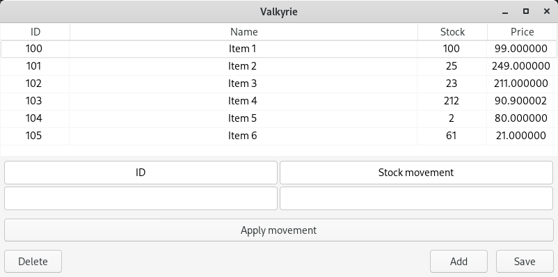
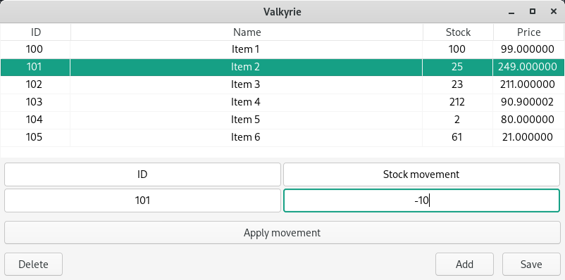
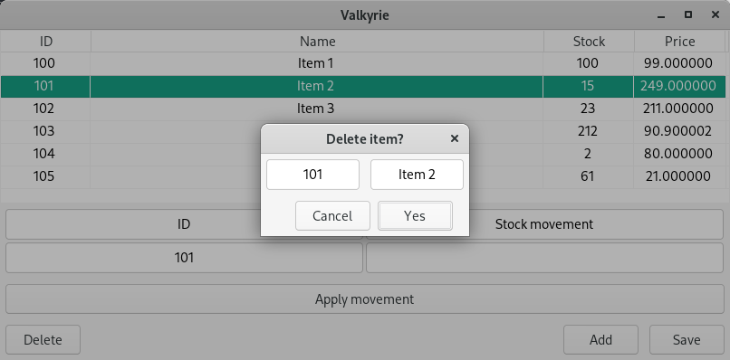
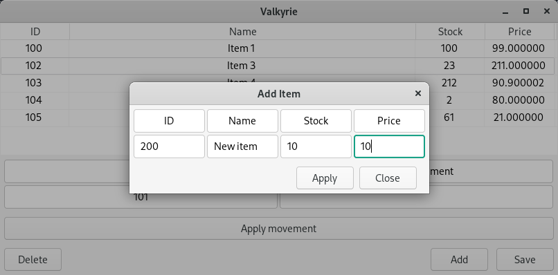

# Valkyrie - Simple stock control application
Built using wxWidgets and C/C++, Valkyrie allows you to keep control of your inventory, providing a simple and un?? user interface. 

## Getting Started
---
### Prerequisites
* Any C/C++ compiler
* wxWidgets library
    - [Download](https://www.wxwidgets.org/downloads/) and [installation](https://wiki.wxwidgets.org/Install) instructions available in the project website.

## Linux:

### Building the project
1. Clone the repository
```
git clone https://github.com/mariano-perez09/valkyrie
```
2. Once wxWidgets is installed, change the project Makefile variable containing the path to the **wx-config** script located in the wxWidgets build folder to your specific install location.
3. Build the project using make
```
make
``` 

## Usage
---
To be able to start, Valkyrie needs to access a file called **list.bin** located in the **saves/** folder. Said file is overwritten every time the list is saved. The application consist of a single window containing the inventory list as well as a movement panel and buttons which provide the basic functionality. The item list can also be sorted by ID, Stock and Price by clicking on any of the named column titles.



To modify available stock, select an item from the list and specify the quantity as a positive or negative integer. Then, click on the *Apply movement* button.



To delete an item, simply select said item and click *Delete*.



Items can also be added using the *Add* button. Note that all ID's must be unique unsigned integers. The name box takes a 20-char string, the stock box takes an unsigned integer, and the price can be a floating point number.

